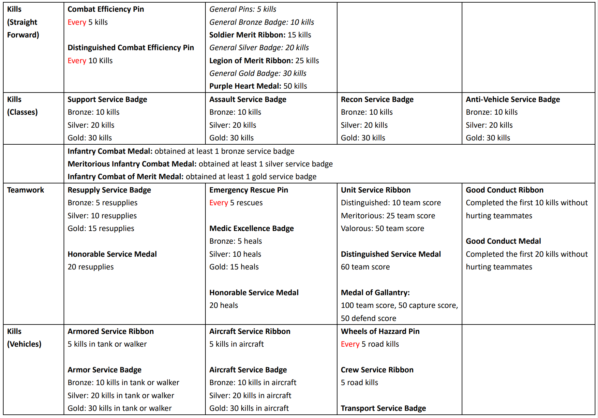
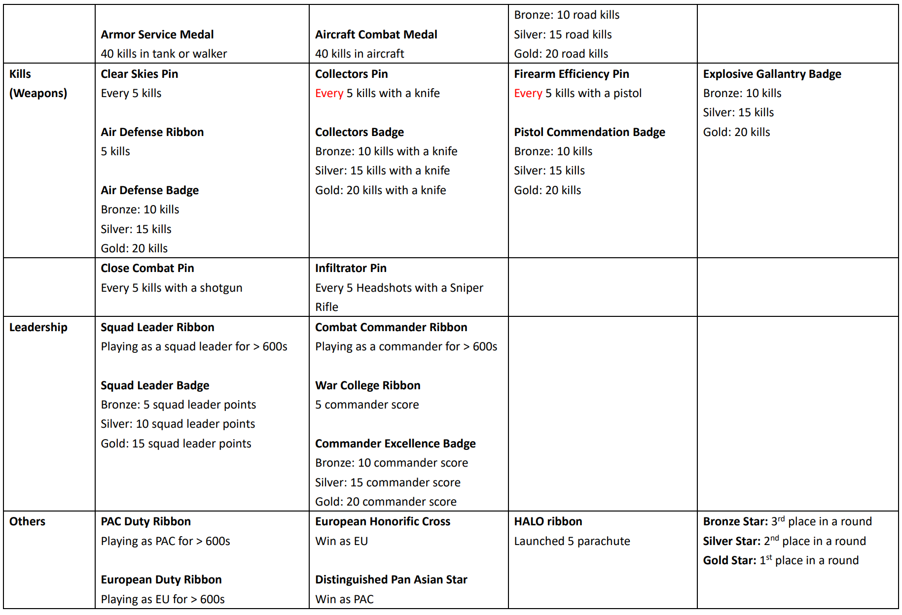

# Offline Rewards Patch

What this patch does is emulate the ranked server's rewards system (pin, ribbons, badges, medals) in your single-player or LAN's coop mode games. But keep in mind that it's just a simulation. The rewards will only last for a round and will be gone once the game ends.

But it's still a very good QoL enhancement as it makes bots grinding a much more enjoyable thing to do. Just imagine getting a bunch of medals in one game and get excited. That's really cool, isn't it?

The problem is that you're not really getting any medals or badges if things work in vanilla standard. Remember the rewards will be reset after every round? But many rewards require something like <mark style="color:blue;">150 Total Hours Played</mark> or <mark style="color:blue;">300 Wins EU Team</mark>, something that just isn't possible to achieve in a single round. So we've revamped the whole rewards system as well as the requirements so that it's much more compatible with a 15-min coop games.

* Removing rewards related to Titan mode.
* Removing requirements that are impossible to achieve.
* Simplified the requirements of many rewards.
* Follows the hierarchy of `Pins < Ribbons < Badges < Medals`.
* Most of the rewards can be obtained in a 15 mins game, preferably a 30 mins one.
* A few rewards may not work properly due to PR's new weapons name.

To lengthen your game duration, simply configure the ticket ratio (available when you create a LAN game). Note that ticket ratio is in the form of multiples. 300 means x3, 350 means x3.5. So the recommended value is somewhere from 200 to 400, and that will allow you to scale up the ticket to around 500 to 1000.

## Procedures


You are strongly advised to back up the game's [Python folder](#user-content-fn-1)[^1] before proceeding to install this patch.


1. Download <mark style="color:blue;">offline\_rewards.zip</mark>.
2. Unzip the file and then drag and drop the Python folder into the root directory of the [game folder](#user-content-fn-2)[^2].
3. Click <mark style="color:blue;">Replace All</mark> if you're asked to do so.

## Downloads



offline\_rewards.zip (Google Drive, 42KB)


SouSource: GetBF2142.net \[[Contact us](https://getbf2142.weebly.com/contact.html) if the link is broken.]&#x20;




## Patch Content

[^1]: i.e., <mark style="color:blue;">/Battlefield 2142/python/</mark>

[^2]: i.e., <mark style="color:blue;">/Battlefield 2142/</mark>
