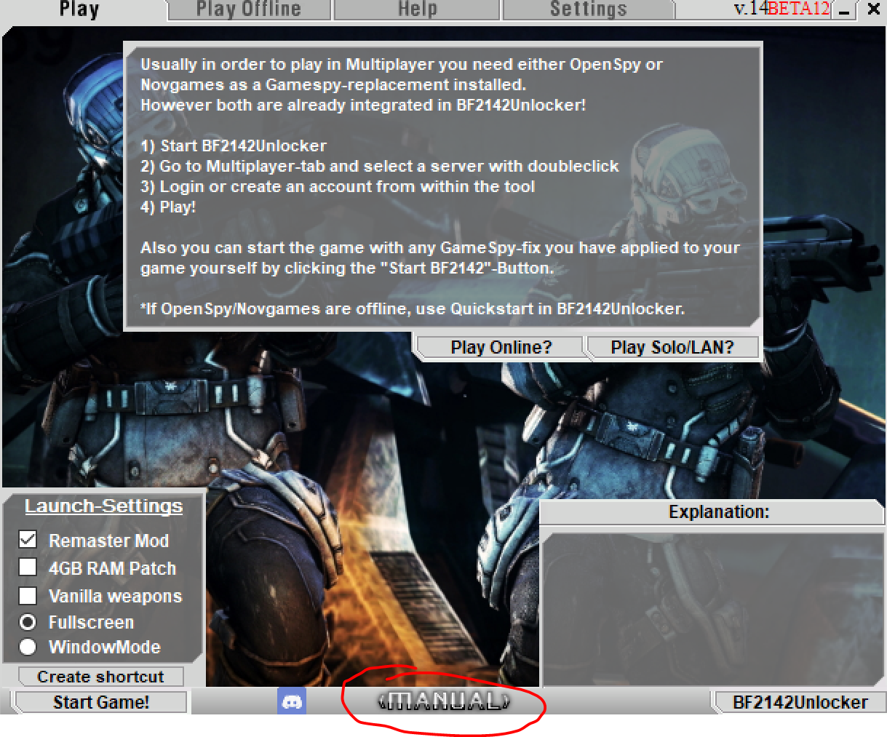

# ☆ Further readings ...


The Project Remaster's manual includes a lot of important information about the game and the mod itself, so we strongly recommend taking the time to read through their materials.


<figure><figcaption>
Source: <a href="https://discord.gg/nVdDkgA">Project Remaster Discord</a>
</figcaption></figure>

The manual is an excellent resource for you to dig deeper about the game. The manual itself is a built-in component of the mod, which means all you have to do is to [install the Project Remaster mod](3.-installing-project-remaster.md) and click the <mark style="color:blue;">Manual</mark> button in the launcher to launch the offline wiki.

<figure><figcaption>
Source: <a href="https://discord.gg/nVdDkgA">Project Remaster Discord</a>
</figcaption></figure>

Enjoy exploring the wiki! See you on the battlefield!
